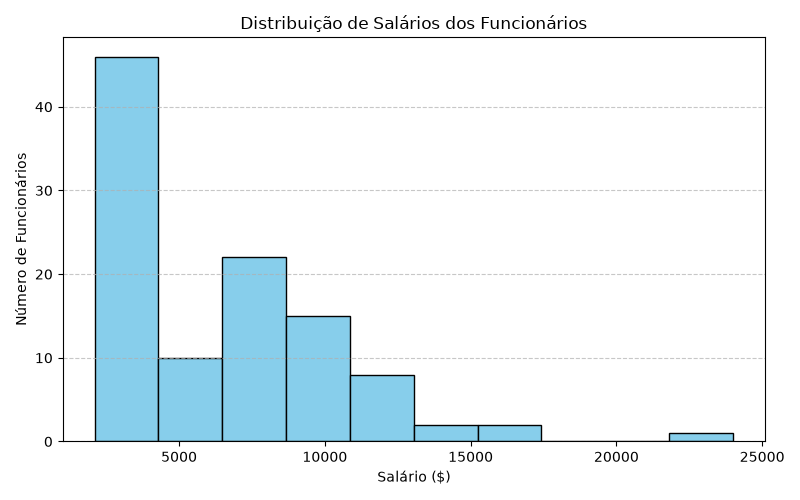
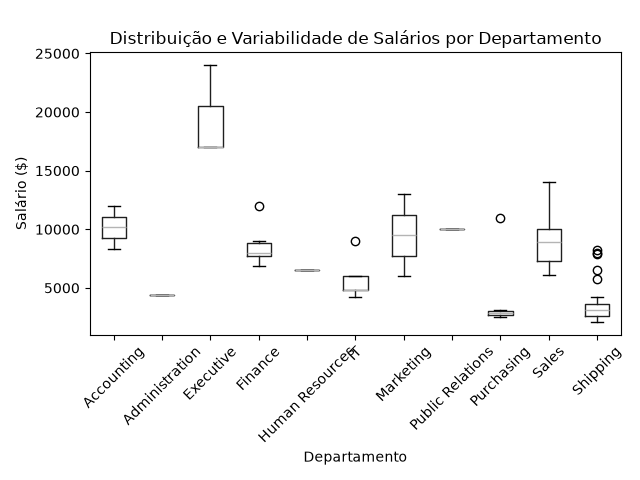

# Projeto Final_M1: Visualização de Dados e Business Intelligence [T3]

**Aluno(a):** Lara Hassen
**Turma:** T3
**Data:** Setembro/2026

---

## 1. Objetivo do Trabalho
Este projeto foi desenvolvido com o objetivo de incentivar o aluno a atuar como analista de dados para a área de recursos humanos (RH). A análise busca compreender a distribuição salarial da empresa, a variação de remuneração entre cargos e departamentos, e a localização geográfica dos colaboradores, transformando dados brutos em insights estratégicos para a gestão da empresa.

---

## 2. Base de Dados Utilizada
A análise utilizou o banco de dados **FreeSQL (Esquema Human Resources - HR)**, composto pelas seguintes tabelas:

* **`FUNCIONÁRIOS`**: Dados dos funcionários (IDs, nomes, salários, cargos e departamentos).
* **`DEPARTAMENTOS`**: Mapeamento dos nomes dos departamentos.
* **`CARGOS`**: Títulos de cargos e faixas salariais permitidas.
* **`LOCALIZAÇÕES`**: Endereços e cidades de alocação dos funcionários.
* **`PAÍSES`**: Países de atuação da empresa.
* **`REGIÕES`**: Regiões geográficas globais.

---

## 3. Resumo das Consultas SQL
Para extrair os dados necessários, foram desenvolvidas duas consultas em SQL utilizando junções (`LEFT JOIN`) e filtros (`WHERE`):

1. **`query_1.sql` (Salário por Departamento e Cargo):**
   * **Objetivo:** Mapear os salários individuais associando cada funcionário ao seu departamento e título de cargo.
   * **Relacionamentos:** `EMPLOYEES` unido com `DEPARTMENTS` e `JOBS`.
   * **Resultado exportado:** `query_01.csv`.

2. **`query_2.sql` (Funcionários por Região e Localização):**
   * **Objetivo:** Identificar a distribuição geográfica dos colaboradores por cidade, país e região.
   * **Relacionamentos:** `EMPLOYEES` unido com `DEPARTMENTS`, `LOCATIONS`, `COUNTRIES` e `REGIONS`.
   * **Resultado exportado:** `query_02.csv`.

---

## 4. Análise Exploratória de Dados (Python)
A etapa de análise em Python foi desenvolvida no script `analise.py`, utilizando as bibliotecas `pandas` e `matplotlib`.

### **Resultados Estatísticos Encontrados:**
* **Média Salarial:** $6.456,75
* **Mediana Salarial:** $6.150,00
* **Menor Salário (Mínimo):** $2.100,00
* **Maior Salário (Máximo):** $24.000,00

### **Média Salarial por Departamento:**
* **Executivo:** $19.333,33
* **Contador:** $10.154,00
* **Relações Públicas:** $10.000,00
* **Marketing:** $9.500,00
* **Vendedores:** $8.955,88
* **Financeiro:** $8.601,33
* **Recursos Humanos:** $6.500,00
* **IT:** $5.760,00
* **Administração:** $4.400,00
* **Compras:** $4.150,00
* **Setor de Envio:** $3.475,56

---

## 5. Visualizações Gráficas

1. # **Distribuição Salarial**
### (Histograma)


2. # **Variabilidade Salarial por Departamento**
### (Boxplot)


---
## 6. Sugestões de Melhorias

Implementar análise de correlação entre o tempo de empresa (data de contratação) e a evolução salarial.
Criar um dashboard interativo no Power BI ou Streamlit para visualização dos indicadores e métricas de recursos humanos em tempo real pela diretoria.
Analisar a disparidade salarial por gênero e faixa de cargo dentro de cada região geográfica.

---

## 7. Como Executar o Projeto

### **Pré-requisitos:**
* Python 3.x instalado na máquina.
* Git instalado.

### **Instalação das Bibliotecas:**
No terminal do seu ambiente, execute:
```bash
pip install pandas matplotlib
Execução do Script:
Clone o repositório:
git clone https://github.com/SEU_USUARIO/Projeto-Final-DT-BI.git
cd Projeto-Final-DT-BI
Execute a análise em Python:
python analise.py
